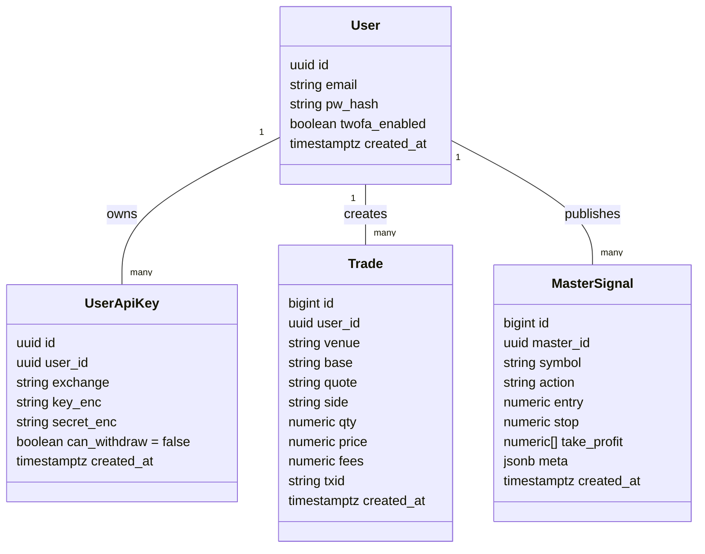
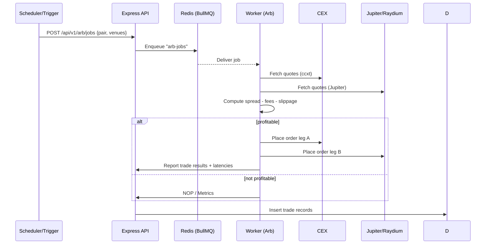
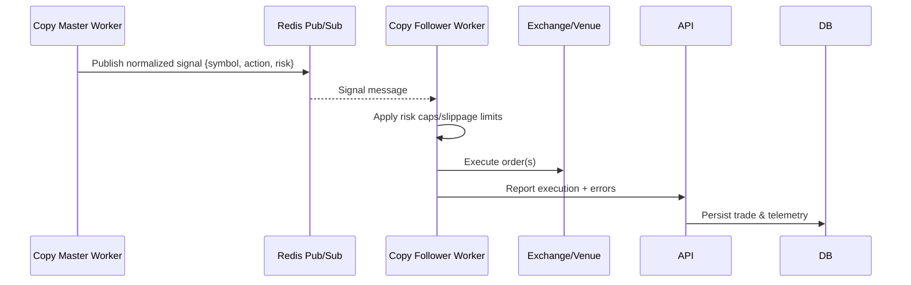
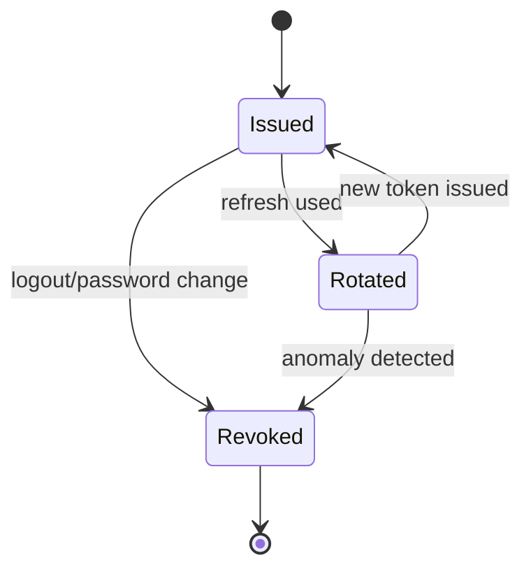
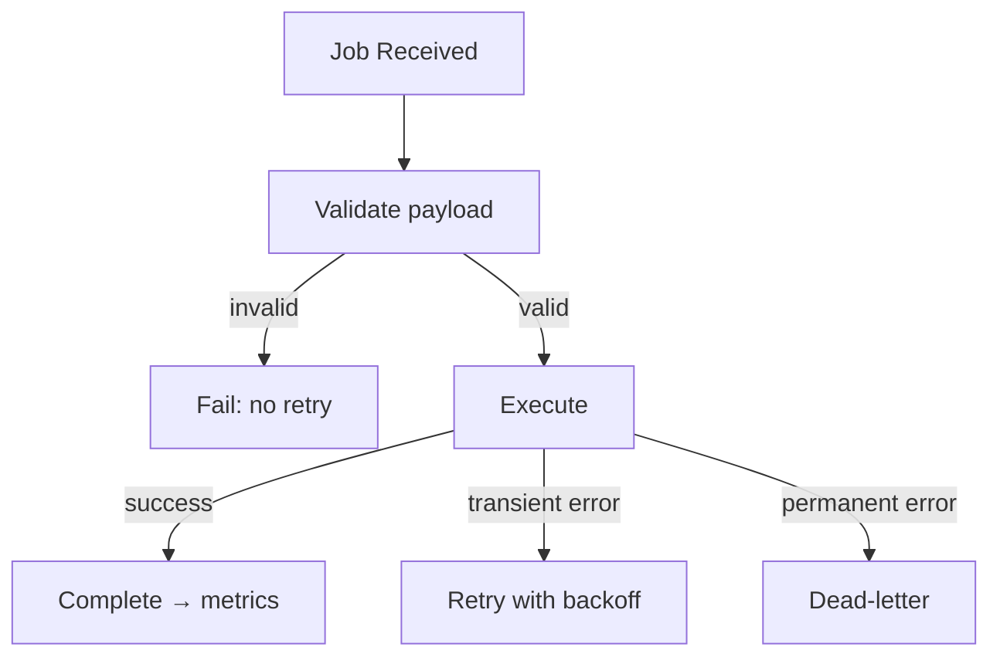
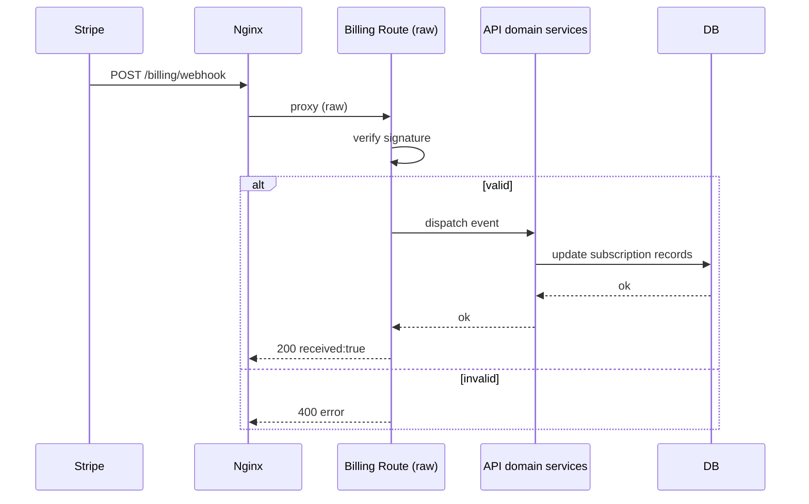

# CRYONEL — Unified Technical Blueprint (All‑in‑One, August 2025)

This single document consolidates and updates:

- CRYONEL_UNIFIED_AGENT.md
- CRYONEL_UNIFIED_MASTER.md
- CRYONEL_CLAUDE_FULL.md

It provides an end‑to‑end blueprint to build, deploy, operate, and evolve CRYONEL: an AI‑powered, zero‑custody crypto automation platform with a self‑improving coding agent.

---

## 0) Quick Start (10‑Minute Bootstrap)

1. Server (Debian 12)

- Update: `sudo apt update && sudo apt -y upgrade`
- Install: `sudo apt -y install curl git ufw fail2ban docker.io docker-compose nginx`
- Node 20: `curl -fsSL https://deb.nodesource.com/setup_20.x | sudo -E bash - && sudo apt -y install nodejs`
- Python 3.11: `sudo apt -y install python3-pip`

2. Users & Firewall

- Create sudo user + SSH keys
- UFW: allow 80, 443, <your-ssh-port>; deny everything else
- Fail2ban: enable default jail

3. Create project

```bash
mkdir -p /srv/cryonel && cd /srv/cryonel
git init && echo "# CRYONEL" > README.md
```

4. Create .env (edit values!)

```bash
cat > .env << 'EOF'
# General
NODE_ENV=production
APP_URL=https://your-domain.com
ENCRYPTION_MASTER_KEY=change_this_64_char_hex

# Database
POSTGRES_USER=cryonel
POSTGRES_PASSWORD=change_me
POSTGRES_DB=cryonel
POSTGRES_HOST=db
POSTGRES_PORT=5432

# Redis
REDIS_HOST=redis
REDIS_PORT=6379

# Stripe
STRIPE_SECRET_KEY=
STRIPE_WEBHOOK_SECRET=

# JWT / Auth
JWT_SECRET=change_this_long_random

# Solana RPC (EU endpoints recommended)
SOLANA_RPC_PRIMARY=
SOLANA_RPC_FALLBACK=
EOF
```

5. Minimal Docker Compose

```yaml
# docker-compose.yml
version: "3.9"
services:
  api:
    build: ./apps/api
    env_file: ./.env
    depends_on: [db, redis]
    ports: ["8080:8080"]
  web:
    build: ./apps/web
    env_file: ./.env
    depends_on: [api]
    ports: ["3000:3000"]
  worker-arb:
    build: ./apps/workers/arb
    env_file: ./.env
    depends_on: [api, redis]
  worker-copy-master:
    build: ./apps/workers/copy-master
    env_file: ./.env
    depends_on: [api, redis]
  worker-copy-follower:
    build: ./apps/workers/copy-follower
    env_file: ./.env
    depends_on: [api, redis]
  db:
    image: postgres:15
    environment:
      POSTGRES_USER: ${POSTGRES_USER}
      POSTGRES_PASSWORD: ${POSTGRES_PASSWORD}
      POSTGRES_DB: ${POSTGRES_DB}
    volumes: ["pg:/var/lib/postgresql/data"]
    ports: ["5432:5432"]
  redis:
    image: redis:7
    ports: ["6379:6379"]
volumes:
  pg: {}
```

6. Scaffold folders

```bash
mkdir -p apps/api/src apps/web/src apps/workers/{arb,copy-master,copy-follower}/src docs/{agent,ops,db} infra tools/{mcp,scripts}
```

7. Run

```bash
docker-compose up -d --build
```

---

## 1) Executive Overview

CRYONEL is an AI-driven crypto automation platform with two pillars:

- Automated Crypto Operations: CEX↔DEX arbitrage, copy trading (master→follower).
- Self‑Improving Development Agent: Claude Code MCP‑integrated loop that edits and enhances its own codebase under strict guardrails.

Principles:

- Zero Custody: Users connect their own exchange keys/wallets; withdrawals disabled at API permission level.
- Security → Reliability → Profitability → Speed.
- Modular, observable, and horizontally scalable architecture.

---

## 2) Business Model

- SaaS subscriptions:
  - Standard: $200/mo
  - Pro: $500/mo (priority execution, more pairs, Asia worker option)
- Optional profit share: 10–20% via Stripe.
- Compliance posture: GDPR‑aligned, EU data residency, encryption at rest/in transit, auditable logs.

---

## 3) System Architecture

Stack:

- Web: Next.js 14, Tailwind, shadcn/ui, responsive + real‑time UI
- API: Node.js + TypeScript + Express
- Workers: BullMQ (Redis), region‑aware arbitrage and copy‑trading workers
- Data: PostgreSQL 15 (pgcrypto), Redis 7
- Infra: Nginx reverse proxy (TLS, HTTP/2, HSTS), Docker Compose
- Observability: Prometheus + Grafana + Loki
- Payments: Stripe
- Agent: Claude Code MCP (fs, fetch, semgrep, Context7)

Low‑Latency Optimizations:

- Prefer EU‑based exchanges for main worker (Contabo Germany).
- Use EU RPC endpoints (QuickNode/Helius) with fallback rotation.
- Benchmark to select lowest‑latency exchange endpoints.
- Parallel order submission and batch signing where possible.

---

## 4) High‑Level Component Diagram

```mermaid
graph TD
  subgraph Client
    A[Browser / Mobile] --> B[Next.js Web]
  end

  subgraph Server (Contabo Debian 12)
    B --> C[Express API]
    C <-->|REST| D[(PostgreSQL 15)]
    C <-->|BullMQ| E[(Redis 7)]
    C -->|Stripe| S[Stripe API]

    E --> W1[Worker: Arbitrage EU]
    E --> W2[Worker: Arbitrage Asia]
    E --> W3[Worker: Copy Master]
    E --> W4[Worker: Copy Follower]

    N[Nginx TLS/H2] --> B
    N --> C
    P[Prometheus] --> C
    P --> W1
    P --> W2
    P --> W3
    P --> W4
    G[Grafana] --> P
    L[Loki Logs] --> C
    L --> W1
    L --> W2
    L --> W3
    L --> W4
  end
```

---

## 5) Deployment Diagram

```mermaid
flowchart LR
  subgraph Internet
    User[User]
  end

  subgraph Contabo VPS (Germany, Debian 12)
    Nginx[Nginx + TLS]
    Web[Next.js Web (Node 20)]
    API[Express API (Node 20)]
    Redis[Redis 7]
    Postgres[PostgreSQL 15]
    ArbEU[Worker: Arbitrage EU]
    ArbAsia[Worker: Arbitrage Asia]
    CopyMaster[Worker: Copy Master]
    CopyFollower[Worker: Copy Follower]
    Telemetry[Prometheus + Grafana + Loki]
  end

  User -->|HTTPS 443| Nginx
  Nginx --> Web
  Nginx --> API
  API <--> Redis
  API <--> Postgres
  Redis --> ArbEU
  Redis --> ArbAsia
  Redis --> CopyMaster
  Redis --> CopyFollower
  Telemetry --> API
  Telemetry --> ArbEU
  Telemetry --> ArbAsia
  Telemetry --> CopyMaster
  Telemetry --> CopyFollower
```

---

## 6) Data Model



SQL (idempotent):

```sql
-- users & auth
create table if not exists users(
  id uuid primary key default gen_random_uuid(),
  email text unique not null,
  pw_hash text not null,
  twofa_enabled boolean default false,
  created_at timestamptz default now()
);

-- exchange api keys (encrypted)
create table if not exists user_api_keys(
  id uuid primary key default gen_random_uuid(),
  user_id uuid references users(id) on delete cascade,
  exchange text not null,       -- 'binance','bybit','kraken',...
  key_enc text not null,
  secret_enc text not null,
  can_withdraw boolean default false, -- must be false
  created_at timestamptz default now()
);

-- trades & signals
create table if not exists trades(
  id bigserial primary key,
  user_id uuid references users(id) on delete cascade,
  venue text not null,           -- 'kraken','raydium','jupiter'
  base text not null,
  quote text not null,
  side text not null,            -- 'buy'|'sell'
  qty numeric not null,
  price numeric not null,
  fees numeric not null,
  txid text,
  created_at timestamptz default now()
);

create table if not exists master_signals(
  id bigserial primary key,
  master_id uuid references users(id) on delete cascade,
  symbol text not null,
  action text not null,        -- 'open','close'
  entry numeric,
  stop numeric,
  take_profit numeric[],
  meta jsonb default '{}'::jsonb,
  created_at timestamptz default now()
);
```

---

## 7) Critical Sequences

Arbitrage job lifecycle:



Copy trading master→follower:



---

## 8) Project Layout (Monorepo, File‑Level)

```text
/srv/cryonel
├─ .env
├─ docker-compose.yml
├─ README.md
├─ docs/
│  ├─ agent/
│  │  ├─ system-prompt.md
│  │  └─ tools.md
│  ├─ ops/
│  │  ├─ runbooks.md
│  │  ├─ security-checklist.md
│  │  └─ monitoring.md
│  └─ db/
│     └─ schema.sql
├─ apps/
│  ├─ api/
│  │  ├─ package.json
│  │  ├─ tsconfig.json
│  │  └─ src/
│  │     ├─ server.ts
│  │     ├─ routes.ts
│  │     ├─ routes/
│  │     │  ├─ auth.ts
│  │     │  ├─ keys.ts
│  │     │  ├─ orders.ts
│  │     │  └─ signals.ts
│  │     ├─ lib/
│  │     │  ├─ crypto.ts
│  │     │  ├─ db.ts
│  │     │  ├─ logger.ts
│  │     │  └─ metrics.ts
│  │     ├─ middleware/
│  │     │  ├─ auth.ts
│  │     │  └─ rateLimit.ts
│  │     └─ migrations/
│  │        └─ 0001_init.sql
│  ├─ web/
│  │  ├─ package.json
│  │  ├─ next.config.mjs
│  │  ├─ tsconfig.json
│  │  └─ src/
│  │     ├─ app/
│  │     │  ├─ layout.tsx
│  │     │  ├─ page.tsx
│  │     │  ├─ dashboard/page.tsx
│  │     │  ├─ api-keys/page.tsx
│  │     │  ├─ signals/page.tsx
│  │     │  ├─ history/page.tsx
│  │     │  └─ settings/page.tsx
│  │     ├─ components/
│  │     │  ├─ ui/                  # shadcn/ui
│  │     │  ├─ charts/PnLChart.tsx
│  │     │  ├─ tables/TradesTable.tsx
│  │     │  └─ widgets/LatencyCard.tsx
│  │     ├─ lib/
│  │     │  ├─ api.ts
│  │     │  └─ auth.ts
│  │     └─ styles/globals.css
│  └─ workers/
│     ├─ arb/
│     │  ├─ package.json
│     │  ├─ tsconfig.json
│     │  └─ src/
│     │     ├─ worker.ts
│     │     ├─ engine.ts
│     │     ├─ venues/cex.ts
│     │     └─ venues/dex.ts
│     ├─ copy-master/
│     │  ├─ package.json
│     │  └─ src/master.ts
│     └─ copy-follower/
│        ├─ package.json
│        └─ src/follower.ts
├─ infra/
│  ├─ nginx.conf
│  ├─ grafana/
│  ├─ prometheus/
│  └─ loki/
└─ tools/
   ├─ mcp/
   │  └─ claude.json
   └─ scripts/
      ├─ deploy.sh
      └─ backup-db.sh
```

---

## 9) API Essentials (Node + TS)

Server:

```ts
// apps/api/src/server.ts
import express from "express";
import helmet from "helmet";
import cors from "cors";
import routes from "./routes";

const app = express();
app.use(helmet());
app.use(cors({ origin: process.env.APP_URL, credentials: true }));
app.use(express.json({ limit: "1mb" }));

app.use("/api/v1", routes);

const port = process.env.PORT || 8080;
app.listen(port, () => console.log(`API listening on ${port}`));
```

Router:

```ts
// apps/api/src/routes.ts
import { Router } from "express";
import auth from "./routes/auth";
import keys from "./routes/keys";
import orders from "./routes/orders";
import signals from "./routes/signals";

const r = Router();
r.use("/auth", auth);
r.use("/keys", keys);
r.use("/orders", orders);
r.use("/signals", signals);
export default r;
```

Crypto helpers:

```ts
// apps/api/src/lib/crypto.ts
import crypto from "crypto";
const ALGO = "aes-256-gcm";
const KEY = Buffer.from(process.env.ENCRYPTION_MASTER_KEY!, "hex");

export function enc(plain: string) {
  const iv = crypto.randomBytes(12);
  const cipher = crypto.createCipheriv(ALGO, KEY, iv);
  const enc = Buffer.concat([cipher.update(plain, "utf8"), cipher.final()]);
  const tag = cipher.getAuthTag();
  return Buffer.concat([iv, tag, enc]).toString("base64");
}

export function dec(b64: string) {
  const raw = Buffer.from(b64, "base64");
  const iv = raw.subarray(0, 12);
  const tag = raw.subarray(12, 28);
  const data = raw.subarray(28);
  const decipher = crypto.createDecipheriv(ALGO, KEY, iv);
  decipher.setAuthTag(tag);
  const dec = Buffer.concat([decipher.update(data), decipher.final()]);
  return dec.toString("utf8");
}
```

---

## 10) Workers & Queues (BullMQ)

Arbitrage worker:

```ts
// apps/workers/arb/src/worker.ts
import { Worker, Queue } from "bullmq";
import { routeAndExecute } from "./engine";

const qName = "arb-jobs";
new Worker(
  qName,
  async (job) => {
    const { pair, venues } = job.data;
    return routeAndExecute(pair, venues);
  },
  {
    connection: {
      host: process.env.REDIS_HOST!,
      port: +process.env.REDIS_PORT!,
    },
  }
);

export const arbQueue = new Queue(qName, {
  connection: { host: process.env.REDIS_HOST!, port: +process.env.REDIS_PORT! },
});
```

Engine (pseudo):

```ts
// apps/workers/arb/src/engine.ts
export async function routeAndExecute(pair: string, venues: string[]) {
  // 1) Pull quotes from CEX (ccxt) and DEX (Jupiter)
  // 2) If spread > threshold + fees + slippage, submit atomic legs
  // 3) Record trade details and latencies
  return { ok: true };
}
```

Copy trading:

- Master publishes normalized signals to Redis Pub/Sub.
- Followers subscribe, enforce risk rules (position sizing, drawdown, slippage), execute venue orders.

---

## 11) Web (Next.js 14 + Tailwind + shadcn/ui)

Pages:

- Landing, Dashboard (PnL + live latency), API Keys, Signals, History, Settings.
- Auth: JWT with refresh; optional TOTP.
- Real‑time: WebSocket for spreads and trades.
- UI/UX: Mobile‑first, dark/light theme, shadcn/ui.

---

## 12) Security Model

- Encryption: AES‑256‑GCM for API keys; master key via env; pgcrypto optional for column encryption.
- API policy: Exchange keys with trade+read only; withdrawals disabled.
- Network: UFW firewall (80/443/SSH), services bound to localhost; fail2ban.
- Backups: Daily Postgres + Redis snapshots to encrypted S3 (EU).
- Access: Cloudflare Zero Trust for admin; SSH on non‑standard port.
- Code: Semgrep MCP on PRs; dependency audit in CI.
- Users: Strong passwords, TOTP, session revocation.
- Auditability: Central logs in Loki with immutable retention.

---

## 13) Observability

- Prometheus metrics: API latency/error rates, worker job timings, order round‑trip latency.
- Grafana dashboards: per service and trading KPIs (spread capture %, win rate, avg fee %).
- Loki logs: query by service, userId, jobId.
- Alerts: CPU>85%, mem>85%, RPC down, exchange WS disconnects, error spikes.

---

## 14) Nginx Reverse Proxy (TLS + HTTP/2 + HSTS)

```nginx
server {
  listen 80;
  server_name your-domain.com;
  return 301 https://$host$request_uri;
}

server {
  listen 443 ssl http2;
  server_name your-domain.com;

  ssl_certificate     /etc/letsencrypt/live/your-domain.com/fullchain.pem;
  ssl_certificate_key /etc/letsencrypt/live/your-domain.com/privkey.pem;

  add_header Strict-Transport-Security "max-age=15552000; includeSubDomains" always;

  location / {
    proxy_pass http://127.0.0.1:3000;
    proxy_set_header Host $host;
    proxy_set_header X-Forwarded-For $remote_addr;
  }

  location /api/ {
    proxy_pass http://127.0.0.1:8080/;
    proxy_set_header Host $host;
    proxy_set_header X-Forwarded-For $remote_addr;
  }
}
```

---

## 15) Claude Code MCP Integration

Authoritative system prompt:

```text
You are CRYONEL, an AI coding & trading assistant operating within a strict, zero‑custody architecture.
Your priorities: SECURITY → RELIABILITY → PROFITABILITY → SPEED.

Rules:
1) Never request or store withdrawal permissions for any CEX API keys.
2) Never print or exfiltrate secrets. Use placeholders or env references.
3) For shell actions, propose commands and WAIT for approval if destructive.
4) Keep migrations idempotent. Avoid breaking schema changes.
5) Prefer creating PRs/patches over directly editing critical files.
6) Log all decisions and outcomes to /var/log/cryonel (or app logs).
7) If unsure, generate a plan, risks, rollback, and tests first.
```

Tool registry (conceptual):

```ts
// docs/agent/tools.md
- code_editor: edit files within repo (MCP fs)
- web_search: fetch context (MCP fetch or web tool)
- bash: limited safe commands (lint, build, tests, docker compose)
- http_call: call internal API endpoints (read-only in prod)
- pr_create: propose patches instead of direct edits (optional)
```

Execution loop (pseudo):

```python
while True:
  task = get_next_task()
  plan = model.suggest_plan(task, tools=REGISTRY)
  safe_commands = guard(plan)
  results = run(safe_commands)
  log(results)
```

Project‑scoped MCP config:

```json
{
  "mcpServers": {
    "context7": { "transport": "http", "url": "https://mcp.context7.com/mcp" },
    "fs": {
      "command": "docker",
      "args": [
        "run",
        "-i",
        "--rm",
        "-v",
        "/srv/cryonel:/mnt/work",
        "node:20-alpine",
        "npx",
        "-y",
        "@modelcontextprotocol/server-filesystem",
        "/mnt/work"
      ]
    },
    "fetch": {
      "command": "docker",
      "args": [
        "run",
        "-i",
        "--rm",
        "node:20-alpine",
        "npx",
        "-y",
        "@modelcontextprotocol/server-fetch"
      ]
    },
    "semgrep": { "command": "uvx", "args": ["semgrep-mcp"] }
  }
}
```

---

## 16) UI/UX Specification

Principles:

- Minimalist trader‑focused UI, mobile‑first, dark/light modes.
- shadcn/ui with Tailwind theme overrides.

Pages:

- Landing (hero, features, pricing, testimonials)
- Dashboard (PnL graph, active trades, latency, start/stop bot)
- API Management (add/edit CEX keys, Solana wallet; test connection)
- Trade History (filters, CSV export, profit breakdown)
- Copy Trading (masters list, stats, follow/unfollow, risk slider)
- Settings (subscription with Stripe, alerts, 2FA)

---

## 17) Operator Runbook

- Update images & restart:

```bash
docker-compose pull && docker-compose up -d --build
```

- Logs:

```bash
docker-compose logs -f api
docker-compose logs -f worker-arb
```

- DB shell:

```bash
docker exec -it $(docker ps -qf name=db) psql -U ${POSTGRES_USER} -d ${POSTGRES_DB}
```

- Quick backup:

```bash
docker exec -t $(docker ps -qf name=db) pg_dump -U ${POSTGRES_USER} ${POSTGRES_DB} > /root/cryonel_$(date +%F).sql
```

---

## 18) Risk Controls

- Pre‑trade: spread threshold must exceed fees + slippage + buffer.
- Per‑trade caps: notional max %, venue‑specific size limits.
- Session caps: daily loss, max trades, cooldowns after error bursts.
- Kill‑switch: manual and automatic on anomaly detection.

---

## 19) Roadmap & Future Extensions

Multi‑chain arbitrage (EVM):

- Add Ethereum/BSC via ethers.js; CEX↔Uniswap/Sushi (ETH) and PancakeSwap (BSC).
- Cross‑chain swaps via Wormhole or LI.FI API.
- Smart contract scanners for rug/honeypot detection.
- RPC load balancing with regional endpoints (Infura/Alchemy/Ankr).
- Infra: `arb-worker-evm` service, dedicated Redis channel, RPC key rotation.

AI‑Driven Signal Generation:

- Train LSTM/transformer models on OHLCV, order‑book depth, DEX liquidity, CEX funding rates, sentiment (Twitter/Reddit).
- Real‑time inference microservice (Python FastAPI).
- Broadcast via Redis pub/sub to copy‑trading workers.
- GPU‑optimized VPS; retraining pipeline (weekly/monthly).

Multi‑language (EU/Asia):

- i18n with next‑i18next (EN, DE, ES, FR, TR, ZH).
- Currency/date localization; CDN edge caching for static locales.
- Manage translations via Crowdin/Lokalise.

White‑label:

- Partner dashboards, team RBAC, audit exports.

---

## 20) Security & Compliance Checklist

- Data mapping and retention policy.
- DPA with providers (RPC, Stripe, hosting).
- Admin action logs and immutable audit trails.
- Key rotations and dependency audits (scheduled).
- Third‑party penetration test before public launch.

---

## 21) “Do First” Tasks (Agent + Engineering)

- Validate .env presence and format.
- Generate boilerplates (tsconfig, package.json, lint/build scripts).
- Scaffold API routes with DTO validation.
- BullMQ producers/consumers: prove round‑trip job.
- Encrypted key storage + unit tests.
- Provision Nginx + Certbot; wire to services.
- Expose Prometheus metrics; build Grafana dashboards.
- Integrate Stripe checkout + webhook (test mode).
- Write incident runbooks (RPC down, exchange latency spikes).

---

## 22) References

- CRYONEL Unified Agent concepts (tools, loop, security guardrails).
- Unified Master architecture (VPS topology, UI/UX, business).
- Full Technical Blueprint (Quick Start, MCP setup, ops runbooks).

---

## 1) Architecture Deep‑Dive (Production Details)

### 1.1 API Service (Express + TS)

- Core libs: express, helmet, cors, pino (or pino-http), zod, jsonwebtoken, argon2, pg, prom-client, bullmq
- Middleware order:
  1. security: helmet({contentSecurityPolicy:false}), trust proxy if behind Nginx
  2. CORS: cors({origin: APP_URL, credentials: true})
  3. body: express.json({limit:"1mb"})
  4. rate limit: sliding window Redis-based (see 1.4)
  5. request id + logging: pino-http with req.id
- Auth:
  - Password hashing: argon2id (argon2 package), ops limits aligned to VPS CPU
  - JWT access: 15m TTL; Refresh token: 7d TTL (httpOnly cookie if web host is same domain)
  - Rotation: rotate refresh on each use; revoke on logout; store refresh token hash in DB
- Errors:
  - Single error handler returning JSON: {error: {code, message}, requestId}
  - Map Zod errors to 400; auth errors 401; RBAC 403; not found 404; unexpected 500 with requestId
- Validation: Zod DTOs for every route (request/response)
- RBAC: simple roles field on user (user|admin) for admin endpoints

### 1.2 Database (PostgreSQL 15)

- Extensions: pgcrypto, uuid-ossp (if needed), pg_stat_statements (optional)
- Indexes:
  - users(email unique), trades(user_id, created_at desc), master_signals(master_id, created_at desc)
  - user_api_keys(user_id, exchange), trades(venue, created_at), master_signals(symbol, created_at)
- Constraints:
  - user_api_keys.can_withdraw = false enforced at application layer + CI policy checks
  - trades.side in ('buy','sell') via CHECK or enum
- Migrations:
  - Convention: apps/api/migrations/NNNN_name.sql (idempotent)
  - Runner: simple node script or node-pg-migrate
- Connection pool: pg.Pool single instance; max ~20; idleTimeoutMillis 10s

### 1.3 Workers (BullMQ)

- Queues:
  - arb-jobs (arbitrage evaluation & execution)
  - copy-master-signals (normalize & publish)
  - copy-follower-exec (apply follower rules & execute)
- Worker options:
  - concurrency: arb 4–8 per region, follower 8–16; backoff: expo 1s..30s; attempts: 5
  - removeOnComplete: 1000; removeOnFail: 1000; dead-letter queue pattern (optional)
- Idempotency: jobId derived from deterministic key for dedupe, or include execution nonce
- Retry safety: read-only checks separate from execution; only re-send orders if venue confirms failure or no order id
- Metrics: process duration histogram, success/fail counters, per-venue latency gauges

### 1.4 Rate Limiting (Redis)

- Sliding window or token bucket per route category:
  - public auth endpoints: 10/min/ip
  - trading/internal: 60/min/user
- Redis keys: rl:{route}:{id}:{window}
- 429 payload: {error:{code:"RATE_LIMIT", retryAfter}}

### 1.5 Logging (Loki‑friendly)

- pino transport to stdout; promtail/Loki collects
- Correlation ids: x-request-id header passthrough or generate
- Log shape: {ts, level, service, requestId, userId?, route, msg, duration?, error?}

### 1.6 Observability (Prometheus)

- Metrics naming:
  - http_requests_total{route,method,code}
  - http_request_duration_seconds_bucket{route,method}
  - worker_jobs_total{queue,status}
  - worker_job_duration_seconds_bucket{queue}
  - venue_order_roundtrip_seconds_bucket{venue,side}
  - db_query_duration_seconds_bucket{statement}
- /metrics endpoint protected (basic auth via Nginx or network isolation)

---

## 2) API Surface (DTOs, Validation, Errors)

### 2.1 Auth

- POST /api/v1/auth/register
  - body: {email:string, password:string}
  - 200: {userId:string}
  - errors: EMAIL_TAKEN(409), WEAK_PASSWORD(400)
- POST /api/v1/auth/login
  - body: {email:string, password:string}
  - 200: {accessToken:string, refreshToken:string}
  - errors: INVALID_CREDENTIALS(401)
- POST /api/v1/auth/refresh
  - body: {refreshToken:string}
  - 200: {accessToken:string, refreshToken:string}
- POST /api/v1/auth/logout
  - body: {refreshToken:string}
  - 200: {ok:true}

Zod example:

```ts
import { z } from "zod";
export const RegisterDto = z.object({
  email: z.string().email(),
  password: z.string().min(8),
});
export const LoginDto = RegisterDto;
```

### 2.2 API Keys

- GET /api/v1/keys
  - 200: {items: Array<{id,exchange,createdAt}>}
- POST /api/v1/keys
  - body: {exchange:string, apiKey:string, apiSecret:string}
  - 201: {id:string}
  - Validate: can_withdraw must be false (doc + UI guidance)
- DELETE /api/v1/keys/:id
  - 200: {ok:true}

### 2.3 Orders (normalized for copy followers too)

- POST /api/v1/orders
  - body: {venue:string, base:string, quote:string, side:"buy"|"sell", qty:number, price?:number, type?:"market"|"limit"}
  - 201: {orderId:string, txid?:string}
- GET /api/v1/orders/history?from=&to=&venue=&symbol=
  - 200: {items: Trade[]}

### 2.4 Signals (Copy Trading)

- POST /api/v1/signals/master
  - body: {symbol:string, action:"open"|"close", entry?:number, stop?:number, take_profit?:number[]}
  - 201: {id:number}
- WS or Redis pub/sub downstream handled by workers

### 2.5 Errors (uniform)

```json
{ "error": { "code": "INVALID_INPUT", "message": "..." }, "requestId": "..." }
```

---

## 3) Code Skeletons (Production‑Ready Stubs)

### 3.1 pg Pool

```ts
// apps/api/src/lib/db.ts
import { Pool } from "pg";
export const db = new Pool({
  host: process.env.POSTGRES_HOST,
  port: +(process.env.POSTGRES_PORT || 5432),
  user: process.env.POSTGRES_USER,
  password: process.env.POSTGRES_PASSWORD,
  database: process.env.POSTGRES_DB,
  max: 20,
  idleTimeoutMillis: 10_000,
});
```

### 3.2 Logger (pino)

```ts
// apps/api/src/lib/logger.ts
import pino from "pino";
export const logger = pino({
  level: process.env.LOG_LEVEL || "info",
  base: { service: "api" },
  timestamp: pino.stdTimeFunctions.isoTime,
});
```

### 3.3 Metrics (prom-client)

```ts
// apps/api/src/lib/metrics.ts
import client from "prom-client";
client.collectDefaultMetrics();
export const httpReqDur = new client.Histogram({
  name: "http_request_duration_seconds",
  help: "HTTP req duration",
  labelNames: ["route", "method"],
  buckets: [0.05, 0.1, 0.2, 0.5, 1, 2, 5],
});
export const routerMetrics = (
  route: string,
  method: string,
  fn: () => Promise<any>
) => {
  const end = httpReqDur.startTimer({ route, method });
  return fn().finally(() => end());
};
export const metricsHandler = (_: any, res: any) =>
  res.type("text/plain").send(client.register.metrics());
```

### 3.4 Env Schema (Zod)

```ts
// apps/api/src/lib/env.ts
import { z } from "zod";
export const Env = z.object({
  APP_URL: z.string().url(),
  ENCRYPTION_MASTER_KEY: z.string().length(64),
  POSTGRES_HOST: z.string(),
  POSTGRES_PORT: z.string(),
  POSTGRES_USER: z.string(),
  POSTGRES_PASSWORD: z.string(),
  POSTGRES_DB: z.string(),
  REDIS_HOST: z.string(),
  REDIS_PORT: z.string(),
  JWT_SECRET: z.string().min(32),
  STRIPE_SECRET_KEY: z.string().optional(),
  STRIPE_WEBHOOK_SECRET: z.string().optional(),
});
export const env = Env.parse(process.env);
```

### 3.5 Rate Limit (Redis)

```ts
// apps/api/src/middleware/rateLimit.ts
import { createClient } from "redis";
const r = createClient({
  url: `redis://${process.env.REDIS_HOST}:${process.env.REDIS_PORT}`,
});
r.connect();
export function rl(
  limit: number,
  windowSec: number,
  keyFn: (req: any) => string
) {
  return async (req: any, res: any, next: any) => {
    const k = `rl:${keyFn(req)}:${Math.floor(Date.now() / 1000 / windowSec)}`;
    const c = await r.incr(k);
    if (c === 1) await r.expire(k, windowSec);
    if (c > limit)
      return res
        .status(429)
        .json({ error: { code: "RATE_LIMIT", message: "Too many requests" } });
    next();
  };
}
```

### 3.6 Auth (argon2 + JWT)

```ts
// apps/api/src/middleware/auth.ts
import jwt from "jsonwebtoken";
export const signAccess = (sub: string) =>
  jwt.sign({ sub }, process.env.JWT_SECRET!, { expiresIn: "15m" });
export const signRefresh = (sub: string, ver: number) =>
  jwt.sign({ sub, ver }, process.env.JWT_SECRET!, { expiresIn: "7d" });
export const verify = (t: string) => jwt.verify(t, process.env.JWT_SECRET!);
export const guard = (req: any, res: any, next: any) => {
  const h = req.headers.authorization || "";
  const t = h.startsWith("Bearer ") ? h.slice(7) : "";
  try {
    (req as any).auth = verify(t);
    next();
  } catch {
    res.status(401).json({ error: { code: "UNAUTHORIZED" } });
  }
};
```

---

## 4) Workers: Payloads, Idempotency, Backoff

### 4.1 Queue Payloads

- arb-jobs: { jobId:string, pair:string, venues:string[], threshold:number, maxSlippage:number }
- copy-master-signals: { id:number, symbol:string, action:"open"|"close", entry?:number, stop?:number, tp?:number[] }
- copy-follower-exec: { followerId:string, masterSignalId:number, venue:string, risk:number }

### 4.2 Execution Flow (Arb)

1. fetch CEX quotes (ccxt); fetch DEX quotes (Jupiter/Raydium)
2. compute net spread (after fees + slippage)
3. if profitable:
   - place leg A (CEX) then leg B (DEX) with timeout and safeguard
   - record order ids, tx ids, latencies
4. upsert trade records (idempotent key = venue+clientOrderId)
5. emit metrics and logs

### 4.3 Retries

- attempts: 5; backoff exponential; abort on validation/logic errors; retry on network/timeouts/5xx

---

## 5) Nginx: Hardened Config

- TLS: Let’s Encrypt, HTTP/2
- Security headers (in addition to HSTS):
  - add_header X-Content-Type-Options "nosniff" always;
  - add_header X-Frame-Options "DENY" always;
  - add_header Referrer-Policy "no-referrer-when-downgrade" always;
  - add_header Content-Security-Policy "default-src 'self'; img-src 'self' data: https:; script-src 'self'; style-src 'self' 'unsafe-inline'; connect-src 'self' https:;" always;
- /metrics protected via basic auth or internal network

---

## 6) CI/CD (Minimal, Reliable)

- Lint + TypeCheck: pnpm -w run lint && pnpm -w run typecheck
- Tests: pnpm -w run test
- Security scan: npx semgrep --config p/ci
- Build images: docker-compose build
- Deploy: docker-compose up -d --build
- Migrations: node apps/api/scripts/migrate.js (idempotent)
- Rollback: keep n-1 images; docker-compose down && up previous tags

Example package scripts (root):

```json
{
  "scripts": {
    "lint": "eslint .",
    "typecheck": "tsc -b",
    "test": "vitest run",
    "build": "turbo run build",
    "dev": "turbo run dev --parallel"
  }
}
```

---

## 7) Stripe Webhooks (Signature Verify)

- Endpoint: POST /api/v1/billing/webhook
- Verify signature header: stripe.webhooks.constructEvent(rawBody, sig, STRIPE_WEBHOOK_SECRET)
- Handle events: checkout.session.completed, invoice.paid, customer.subscription.updated

```ts
// apps/api/src/routes/billing.ts
import Stripe from "stripe";
import express from "express";
export const billing = express.Router();
billing.post(
  "/webhook",
  express.raw({ type: "application/json" }),
  (req, res) => {
    const stripe = new Stripe(process.env.STRIPE_SECRET_KEY!);
    const sig = req.headers["stripe-signature"] as string;
    let event;
    try {
      event = stripe.webhooks.constructEvent(
        req.body,
        sig,
        process.env.STRIPE_WEBHOOK_SECRET!
      );
    } catch (e: any) {
      return res.status(400).send(`Webhook Error: ${e.message}`);
    }
    // switch(event.type){ ... }
    res.json({ received: true });
  }
);
```

Note: mount raw body only for this route; keep JSON for others.

---

## 8) Dev Productivity + Token Budget Profile (Claude Code)

- Edit mode:
  - Always open only target file(s) + nearest neighbors; avoid reading entire repo.
  - Use MCP fs to read/write specific paths; avoid verbose context.
- Tool quotas:
  - fetch: ≤3 per task; fs read: ≤10 files per loop; fs write: ≤5 small edits.
- Patch style:
  - Surgical edits; keep existing code; small diffs; reference line ranges.
- Chunking:
  - For big files, operate on sections (functions/modules) only.
- Logging:
  - Keep short logs; use requestId; omit stack at info level; include error name+message at error level.
- DTO reuse:
  - Centralize zod schemas; import across routes to avoid duplication.

---

## 9) Operational Runbook (Expanded)

- Start:
  - docker-compose up -d --build
  - Verify /healthz (add a basic route returning {ok:true})
- Logs:
  - docker-compose logs -f api | grep -v healthz
  - worker logs: docker-compose logs -f worker-arb
- Metrics:
  - curl http://localhost:8080/metrics (if exposed directly) or through Nginx
- DB:
  - psql connection, run EXPLAIN on slow queries; add indexes as needed
- Backups:
  - daily pg_dump; retention 7–14 days; verify restore monthly

---

## 10) Security Enhancements (Actionable)

- Password policy: 12+ chars, zxcvbn check at UI
- 2FA: TOTP enrollment and verification endpoints
- JWT blacklist on password change or suspicious activity
- Dependency pinning; renovate bot weekly
- Secret scanning in CI; forbid committing .env
- RLS: not required here but consider view-level filters in API code by userId

---

## 11) Web Frontend Notes

- Next.js:
  - /app routing; server components default; client only when needed
  - Env via NEXT*PUBLIC*\* only for non-secrets
- UI:
  - Dark mode default; minimal charts (recharts or lightweight)
  - Realtime: native WS or SSE for lower overhead
- Auth:
  - Store access token in memory; refresh via secure cookie or memory + refresh endpoint
  - CSRF not required for pure token auth, else enable double-submit if cookies used

---

## 12) Extended DB DDL (Indexes & Checks)

```sql
create index if not exists idx_trades_user_created on trades(user_id, created_at desc);
create index if not exists idx_trades_venue_created on trades(venue, created_at desc);
create index if not exists idx_ms_master_created on master_signals(master_id, created_at desc);
create index if not exists idx_ms_symbol_created on master_signals(symbol, created_at desc);

alter table trades add column if not exists type text default 'market';
alter table trades add constraint trades_side_chk check (side in ('buy','sell'));
```

---

## 13) Configuration Defaults (tsconfig, next, eslint)

tsconfig (api/workers):

```json
{
  "compilerOptions": {
    "target": "ES2022",
    "module": "CommonJS",
    "moduleResolution": "Node",
    "strict": true,
    "esModuleInterop": true,
    "skipLibCheck": true,
    "outDir": "dist",
    "types": ["node"]
  },
  "include": ["src"]
}
```

next.config.mjs (web):

```js
const nextConfig = {
  reactStrictMode: true,
  experimental: { serverActions: true },
};
export default nextConfig;
```

---

## 14) Environment Variables (Complete List)

- General: NODE_ENV, APP_URL
- DB: POSTGRES_HOST, POSTGRES_PORT, POSTGRES_USER, POSTGRES_PASSWORD, POSTGRES_DB
- Redis: REDIS_HOST, REDIS_PORT
- Crypto: ENCRYPTION_MASTER_KEY
- Auth: JWT_SECRET
- Stripe: STRIPE_SECRET_KEY, STRIPE_WEBHOOK_SECRET
- Optional: LOG_LEVEL, REGION

---

## 15) Testing Strategy (Minimal)

- Unit: DTO validation, crypto enc/dec, auth guard, rate limiter
- Integration: auth flow (register→login→refresh→logout), keys CRUD, orders post→history
- Worker: simulate arb inputs; ensure metrics and idempotency
- Load: k6 or autocannon on GET/POST hot paths

### Rate Limiting Coverage

- Per-IP for auth routes: keyFn = (req)=>req.ip
- Per-user for trading routes: keyFn = (req)=>req.auth?.sub || req.ip

### RBAC/Admin Endpoints

```sql
alter table users add column if not exists role text default 'user';
```

- Add `requireRole('admin')` middleware on admin/ops routes.

### CSP Sources (Connect)

- Extend `connect-src` for Stripe + allowed exchange/RPC endpoints only.

### WebSocket/SSE Channels

- `spreads:{symbol}`, `trades:{userId}`, `signals:master:{masterId}` with auth on subscribe.

### Backup/Restore Script

```bash
# tools/scripts/restore-db.sh
psql "postgres://${POSTGRES_USER}:${POSTGRES_PASSWORD}@${POSTGRES_HOST}:${POSTGRES_PORT}/${POSTGRES_DB}" < "$1"
```

### Migration Runner

- `apps/api/scripts/migrate.ts` to load and apply `migrations/*.sql` in order with logging.

## Additional UML (Auth + Tokens State)

### Refresh Token State Machine



### Queue Failure Handling



### Stripe Billing Sequence


